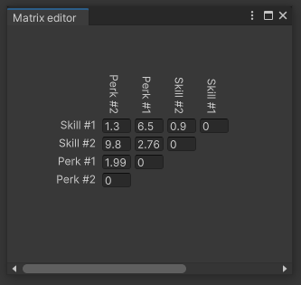
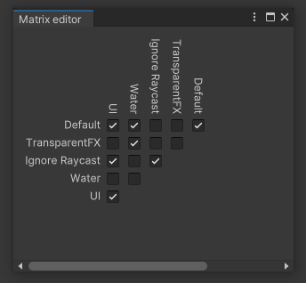

# Matrix Tool
Matrix Tool is a very simple set of scripts which provides you with ability to mimick Unity's physics layer collision matrix

Example matrix of in-game abilities.

Layer collision matrix copycat.
